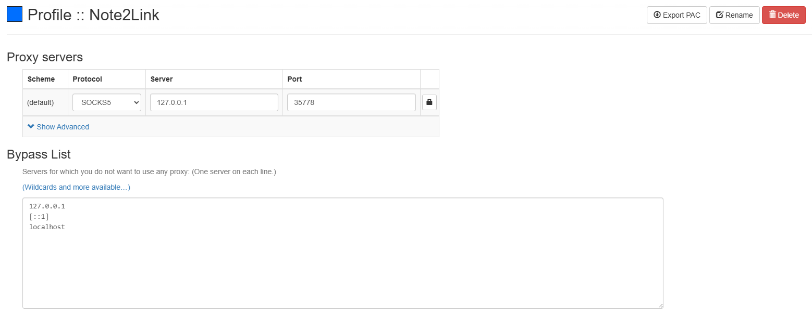

# Note2Link Masaüstü İstemcisi Port Ayarları Kılavuzu

Bu belge, hızlandırma ve senkronizasyon özelliklerinden tam olarak yararlanmak için Note2Link masaüstü istemcisinin port ayarlarını nasıl yapılandıracağınızı açıklamaktadır.

## Port Ayarlarına Genel Bakış

Note2Link masaüstü istemcisi iki tür proxy port ayarı sunar:
1. **Sistem Proxy Portu**: Sistem uygulamaları için (not alma yazılımları gibi)
2. **Tarayıcı Proxy Portu**: Tarayıcı uzantılarıyla kullanım için

## Sistem Proxy Portu

Sistem proxy portu, sistem proxy'sini otomatik olarak ayarlamak için kullanılır ve not alma yazılımları için hızlandırma ve senkronizasyon özelliklerini etkinleştirir.

- Varsayılan port: **35777**
- İşlev: Note2Link istemcisi sistem proxy'sini otomatik olarak ayarlar, manuel yapılandırma gerekmez
- Uygulama senaryoları: Çeşitli not alma yazılımları için hızlandırma ve senkronizasyon

> **İpucu**: Varsayılan port diğer uygulamalarla çakışıyorsa, kullanılmayan başka bir porta değiştirebilirsiniz.

## Tarayıcı Proxy Portu

Tarayıcı proxy portu, tarayıcı uzantılarıyla kullanılmalıdır. İşte yapılandırma adımları:

### Önerilen: Proxy SwitchyOmega 3 (ZeroOmega)

Tarayıcılar Manifest V2 desteğini kademeli olarak sonlandırdığından, yeni Manifest V3'ü destekleyen, Proxy SwitchyOmega'nın modifiye edilmiş bir versiyonu olan **Proxy SwitchyOmega 3 (ZeroOmega)**'yı, kısaca **ZeroOmega**'yı kullanmanızı öneririz.

#### ZeroOmega Yapılandırma Adımları:

1. Tarayıcı uzantı mağazasından **Proxy SwitchyOmega 3 (ZeroOmega)**'yı yükleyin
2. Uzantı ayarları arayüzünü açın
3. Aşağıdaki ayarlarla yeni bir proxy yapılandırması oluşturun:
   - Proxy protokolü: **SOCKS5**
   - Proxy sunucusu: **127.0.0.1**
   - Proxy portu: **35778** (Note2Link varsayılan tarayıcı proxy portu)

4. Yapılandırmayı kaydedin ve uygulayın

#### Kullanım Yöntemi:

1. Tarayıcı araç çubuğundaki ZeroOmega simgesine tıklayın
2. Oluşturduğunuz Note2Link proxy yapılandırmasını seçin
3. Tarayıcınız artık Note2Link üzerinden hızlandırılmıştır

> **Not**: SwitchyOmega'dan geçiş yapan kullanıcılar için, ZeroOmega'nın yönetim arayüzü neredeyse aynıdır ve sorunsuz bir değişim sağlar.

## Sık Karşılaşılan Sorunlar

### Port zaten kullanımdaysa ne yapmalı?

Varsayılan port başka bir uygulama tarafından kullanılıyorsa, Note2Link ayarlarında kullanılmayan başka bir porta değiştirebilir, ardından tarayıcı uzantısı yapılandırmanızı buna göre güncelleyebilirsiniz.

### Neden ZeroOmega önerilir?

Çünkü orijinal Proxy SwitchyOmega, tarayıcıların kademeli olarak desteklemeyi bıraktığı Manifest V2'ye dayanmaktadır. Proxy SwitchyOmega 3 (ZeroOmega) Manifest V3'ü destekler, bu da tarayıcı uzantınızın uzun vadeli kullanımını sağlar.

## Özet

Note2Link'in port ayarlarını ve tarayıcı uzantısını doğru bir şekilde yapılandırarak, Note2Link tarafından sağlanan hızlandırma ve senkronizasyon özelliklerinden tam olarak yararlanabilir, not alma yazılımı ve tarayıcı deneyiminizi geliştirebilirsiniz. Bu ayarlar, notlarınızı ister yerel uygulamalarda ister web tarama sırasında olsun, daha etkili bir şekilde yönetmenize ve erişmenize yardımcı olacaktır.
