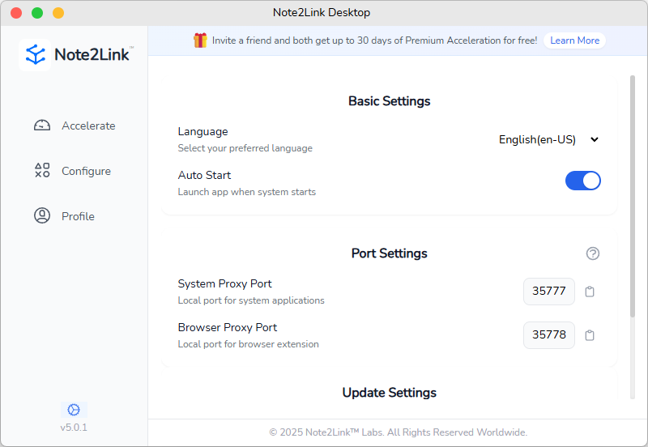
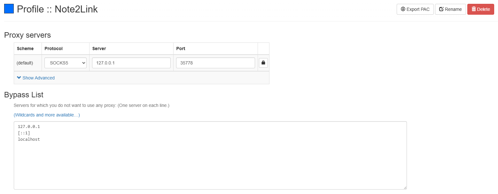

# Hướng dẫn Cài đặt Cổng cho Ứng dụng Máy tính Note2Link

Tài liệu này sẽ hướng dẫn bạn cách cấu hình cài đặt cổng của ứng dụng máy tính Note2Link để tận dụng tối đa các tính năng tăng tốc và đồng bộ hóa.

## Tổng quan về Cài đặt Cổng

Ứng dụng máy tính Note2Link cung cấp hai loại cài đặt cổng proxy:
1. **Cổng Proxy Hệ thống**: Dành cho các ứng dụng hệ thống (như phần mềm ghi chú)
2. **Cổng Proxy Trình duyệt**: Để sử dụng với các tiện ích mở rộng trình duyệt

## Cổng Proxy Hệ thống

Cổng proxy hệ thống được sử dụng để tự động thiết lập proxy hệ thống, cho phép các tính năng tăng tốc và đồng bộ hóa cho phần mềm ghi chú.

- Cổng mặc định: **35777**
- Chức năng: Ứng dụng Note2Link tự động thiết lập proxy hệ thống, không cần cấu hình thủ công
- Tình huống áp dụng: Tăng tốc và đồng bộ hóa cho các phần mềm ghi chú khác nhau

> **Mẹo**: Nếu cổng mặc định xung đột với các ứng dụng khác, bạn có thể thay đổi thành cổng khác chưa được sử dụng.

## Cổng Proxy Trình duyệt

Cổng proxy trình duyệt cần được sử dụng với các tiện ích mở rộng trình duyệt. Dưới đây là các bước cấu hình:

### Đề xuất: Proxy SwitchyOmega 3 (ZeroOmega)

Khi các trình duyệt dần dừng hỗ trợ Manifest V2, chúng tôi đề xuất sử dụng **Proxy SwitchyOmega 3 (ZeroOmega)**, viết tắt là **ZeroOmega**, một phiên bản được chỉnh sửa từ Proxy SwitchyOmega hỗ trợ Manifest V3 mới.

#### Các bước cấu hình ZeroOmega:

1. Cài đặt **Proxy SwitchyOmega 3 (ZeroOmega)** từ cửa hàng tiện ích mở rộng trình duyệt
2. Mở giao diện cài đặt tiện ích mở rộng
3. Tạo cấu hình proxy mới với các cài đặt sau:
   - Giao thức proxy: **SOCKS5**
   - Máy chủ proxy: **127.0.0.1**
   - Cổng proxy: **35778** (cổng proxy trình duyệt mặc định của Note2Link)

4. Lưu và áp dụng cấu hình

#### Cách sử dụng:

1. Nhấp vào biểu tượng ZeroOmega trên thanh công cụ trình duyệt
2. Chọn cấu hình proxy Note2Link bạn đã tạo
3. Trình duyệt của bạn hiện đã được tăng tốc thông qua Note2Link

> **Lưu ý**: Đối với người dùng đang chuyển từ SwitchyOmega, giao diện quản lý của ZeroOmega gần như giống hệt, cho phép thay thế suôn sẻ.

## Vấn đề thường gặp

### Làm gì nếu cổng đã được sử dụng?

Nếu cổng mặc định đang được sử dụng bởi ứng dụng khác, bạn có thể thay đổi sang cổng khác chưa sử dụng trong cài đặt Note2Link, sau đó cập nhật cấu hình tiện ích mở rộng trình duyệt tương ứng.

### Tại sao nên sử dụng ZeroOmega?

Vì Proxy SwitchyOmega ban đầu dựa trên Manifest V2, mà các trình duyệt đang dần ngừng hỗ trợ. Proxy SwitchyOmega 3 (ZeroOmega) hỗ trợ Manifest V3, đảm bảo tiện ích mở rộng trình duyệt của bạn có thể được sử dụng lâu dài.

## Tóm tắt

Bằng cách cấu hình đúng cài đặt cổng Note2Link và tiện ích mở rộng trình duyệt, bạn có thể tận dụng tối đa các tính năng tăng tốc và đồng bộ hóa do Note2Link cung cấp, nâng cao trải nghiệm sử dụng phần mềm ghi chú và trình duyệt. Những cài đặt này sẽ giúp bạn quản lý và truy cập ghi chú hiệu quả hơn, dù là trong ứng dụng cục bộ hay khi duyệt web.
