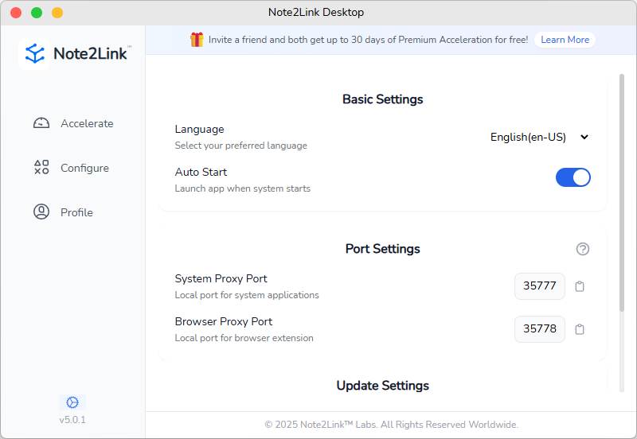

# Note2Link桌面客戶端端口設置指南

本文檔將指導您如何配置Note2Link桌面客戶端的端口設置，以便充分利用加速和同步功能。

## 端口設置概述

Note2Link桌面客戶端提供兩種代理端口設置：
1. **系統代理端口**：用於系統應用程序（如筆記軟件）
2. **瀏覽器代理端口**：用於配合瀏覽器擴展程序

## 系統代理端口

系統代理端口用於自動設置系統代理，使筆記軟件的加速及同步功能即可用。

- 默認端口：**35777**
- 功能：Note2Link客戶端自動設置系統代理，無需手動配置
- 應用場景：各種筆記軟件的加速和同步

> **提示**：如果默認端口與其他應用衝突，您可以修改為其他未被佔用的端口。

## 瀏覽器代理端口

瀏覽器代理端口需要配合瀏覽器擴展程序使用，以下是配置步驟：

### 推薦使用 Proxy SwitchyOmega 3 (ZeroOmega)

由於各大瀏覽器逐步停用Manifest V2支持，我們推薦使用**Proxy SwitchyOmega 3 (ZeroOmega)**，簡稱**ZeroOmega**，它是基於Proxy SwitchyOmega修改而成的插件，支持新版的Manifest V3。

#### ZeroOmega配置步驟：

1. 從瀏覽器擴展商店安裝**Proxy SwitchyOmega 3 (ZeroOmega)**
2. 打開擴展設置界面
3. 創建新的代理配置，設置如下：
   - 代理協議：**SOCKS5**
   - 代理服務器：**127.0.0.1**
   - 代理端口：**35778**（Note2Link默認瀏覽器代理端口）

4. 保存配置並應用

#### 使用方法：

1. 點擊瀏覽器工具欄中的ZeroOmega圖標
2. 選擇您創建的Note2Link代理配置
3. 現在您的瀏覽器已通過Note2Link加速

> **注意**：對於從SwitchyOmega遷移過來的用戶，ZeroOmega的管理界面幾乎一模一樣，可以無縫替換。

## 常見問題

### 端口被佔用怎麼辦？

如果默認端口被其他應用佔用，您可以在Note2Link設置中修改為其他未被佔用的端口，然後相應地更新瀏覽器擴展的配置。

### 為什麼推薦使用ZeroOmega？

因為原版的Proxy SwitchyOmega基於Manifest V2，而各大瀏覽器正在逐步停止支持此版本。Proxy SwitchyOmega 3 (ZeroOmega)支持Manifest V3，確保您的瀏覽器擴展能夠長期使用。

## 總結

通過正確配置Note2Link的端口設置和瀏覽器擴展，您可以充分利用Note2Link提供的加速和同步功能，提升筆記軟件和瀏覽器的使用體驗。這些設置將幫助您更有效地管理和訪問您的筆記內容，無論是在本地應用程序還是在網絡瀏覽過程中。
